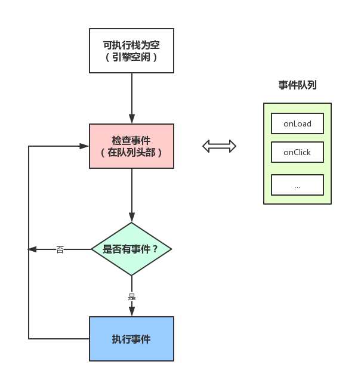
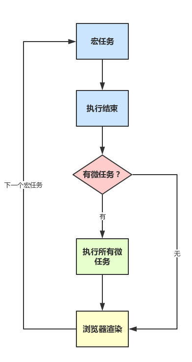

### 0.1+0.2 !== 0.3

- 计算机里所有的数据最终都是以二进制保存的，当然数字也一样。所以当计算机计算0.1+0.2的时候，实际上计算的是这两个数字在计算机里所存储的二进制；
- 0.1、0.2转换为二进制都是无限循环小数，JavaScript采用IEEE 754标准，使用64位固定长度来表示，也就是标准的double双精度浮点数（相关的还有float 32位单精度），所以0.1、0.2二进制存在舍入误差
参考文章：[0.1+0.2 !== 0.3？](https://juejin.im/post/5bd2f10a51882555e072d0c4)

### JavaScript 类型

- 原始类型：number、string、boolean、null、undefined、symbol，原始类型存储值
- 引用类型：Object、Array、Date、RegExp、Promise等，对象类型变量存储地址（指针）

```js
//判断数据类型
let class2type = {};
'Array Date Object RegExp Object Promise'.split(' ').forEach(type => class2type['[object ' + type + ']'] = type.toLowerCase());

const type = (obj) => {
  if (obj == null) return String(obj);
  return typeof obj === 'object' ? class2type[Object.prototype.toString.call(obj)] || 'object' : typeof obj;
}

```

### == 隐式转换步骤


### instanceof原理

能在实例的 原型对象链 中找到该构造函数的prototype属性所指向的 原型对象，就返回true

### Javascript深入系列
参考文章：[JavaScript深入系列15篇正式完结！](https://juejin.im/post/59278e312f301e006c2e1510)

### JavaScript专题系列
参考文章：[JavaScript专题系列20篇正式完结！](https://juejin.im/post/59eff1fb6fb9a044ff30a942)

### JavaScript的作用域概念

- 作用域是指程序源代码中定义变量的区域；
- 作用域规定了如何查找变量的规则，也就是确定了代码中对变量的访问权限；
- JavaScript的作用域是词法作用域，也就是静态作用域，函数在定义时就确定了自己的作用域；
- 当一个函数或块在另一个函数或块中时，就发生了作用域嵌套，在当前作用域查找不到变量就会继续在外层嵌套的作用域中查找，直到找到变量或抵达最外层作用域（全局作用域），这就是作用域链。

### JavaScript执行上下文

- 执行上下文包含：变量对象（函数中是活动对象）、作用域链、this
- 执行上下文栈用于管理执行上下文

参考文章：[JavaScript深入之执行上下文](https://github.com/mqyqingfeng/Blog/issues/8)、[理解 Javascript 执行上下文和执行栈](https://juejin.im/post/5bdfd3e151882516c6432c32)

### JavaScript深入之闭包

- 闭包是能访问自由变量的函数
- 自由变量是指在函数中使用的，但既不是函数参数也不是函数的局部变量的变量
- 闭包 = 函数 + 函数能够访问的自由变量
- 即使创建闭包的上下文已经销毁，依然能够通过闭包所在执行上下文的作用域链访问父级作用域

参考文章：[JavaScript深入之闭包](https://github.com/mqyqingfeng/Blog/issues/9)

### JavaScript面向对象深入理解
请参考文章：[JavaScript 面向对象深入理解](https://buptsteve.github.io/blog/2016/03/17/005.js-oo-chapter6/)

### JavaScript判断this指向
现在我们可以根据优先级来判断函数在某个调用位置应用的是哪条规则。可以按照下面的顺序来进行判断：
1. 函数是否在new中调用(new绑定)?如果是的话this绑定的是新创建的对象。

```js
var bar = new foo()
```

2. 函数是否通过call、apply(显式绑定)或者bind硬绑定调用?如果是的话，this绑定的是 指定的对象。

```js
var bar = foo.call(obj2)
```

3. 函数是否在某个上下文对象中调用(隐式绑定)?如果是的话，this绑定的是那个上 下文对象。

```js
var bar = obj1.foo()
```

4. 如果都不是的话，使用默认绑定。如果在严格模式下，就绑定到undefined，否则绑定到 全局对象。

```js
var bar = foo()
```
注意:对于默认绑定来说，决定 this 绑定对象的并不是调用位置是否处于严格模式，而是 函数体是否处于严格模式。如果函数体处于严格模式，this 会被绑定到 undefined，否则 this 会被绑定到全局对象。

### javascript 垃圾回收机制

- 垃圾定义：内存中的垃圾指的是程序中不在使用的对象对应的内存块。实现判定垃圾算法：引用计数（引用计数法所使用）、对象可达性分析法（标记清除法所使用）
- 垃圾清除时机：内存区域剩余大小，不足以创建新的对象时
- 内存垃圾回收很简单只需执行相应的free api即可，但是要注意在回收过程中怎样处理内存碎片

对象可达性分析

- 每个对象在创建时会有标志位marked设置为false，在垃圾回收时从根对象(全局对象)根据深度优先遍历算法，进行可达性分析，可访问到的对象marked设置为true，则最终标志位为false的对象为可回收对象。
- 优点：能够解决循环引用问题，即能标识出引用成环的垃圾对象为垃圾；
- 缺点：属于事后判定算法，每次执行，都需要遍历所有对象，开销较大；执行时会stop-the-world，有一定的中断时间

标记－清除法、标记－压缩法、复制法、分代法中的垃圾判定算法部分，均使用对象可达性分析算法。所以使用了这些垃圾回收算法的场景，均可认为是对象可达性分析算法的应用场景。

1. 标记清除
   - 直接释放垃圾对象
   - 缺点是没有对内存碎片进行处理，造成内存浪费
2. 复制法
   - 应用场景：分代发中的新生代
   - 将内存区域一分为二，分为对象区(from-space)和空闲区(to-space)，新创建的对象从对象区获取存储空间
   - 如果对象区的剩余空间大小不足以容纳新创建的对象，则会触发垃圾回收
   - 当执行垃圾回收时，会把对象区里的所有存活对象，都复制到空闲区，此时旧的空闲区变成了新的对象区，旧的对象区变成新的空闲区，角色发生了互换
   - 优点：解决了内存碎片问题
   - 缺点：只有一半的内存空间用于存储对象；复制操作开销大；存活对象被移动后，需要找到所有引用了这些存活对象的对象，并更新其引用地址，所以这里包括遍历开销和更新开销；
3. 标记压缩法
   - 应用场景：分代法中的老生代
   - 释放垃圾对象内存空间后，将存活对象往低内存地址复制
   - 优点：解决了内存碎片问题
   - 缺点：复制操作开销大；存活对象被移动后，需要找到所有引用了这些存活对象的对象，并更新其引用地址，所以这里包括遍历开销和更新开销；
4. 分代法（Javascript引擎使用的方法）
   - 将内存区域分为：新生代、老生代，新生代使用复制法，老生代使用标记压缩法
   - 新生代用于存储新创建的对象，这些对象存活时间不长，所以新生代内存空间小
   - 老生代存储生命周期时间长的对象或者大对象(新生代无法容纳)
   - 优点：减少了内存碎片的产生；根据不同内存区域存储的对象的lifetime不同，采用不同的垃圾回收算法，性能更佳
   - 缺点：需要记录每个对象的年龄；执行一次Full GC(老生代GC)时，开销大，耗时长（中断时间也相应长）

请参考： [浅谈程序语言的垃圾回收机制](https://mp.weixin.qq.com/s?__biz=MzU5NzEwMDQyNA==&mid=2247483808&idx=1&sn=06dcf160978dd022a4e5c5c99ad1b073&chksm=fe59d347c92e5a513f42bb071d97247e384d6a3d94cbcb8f03fb200171aa5aa0af1235e910ca&mpshare=1&scene=22&srcid=0824EHt1if6Nq61TpEDriDvj%23rd)

### 浏览器中的javascript运行机制(event loop)



- 主线程运行的时候会生成堆（heap）和栈（stack）；
- js 从上到下执行代码，将其中的同步任务按照执行顺序排列到执行栈中；；
- 当程序调用外部的 API 时，比如 ajax、setTimeout 等，会将此类异步任务挂起，继续执行执行栈中的任务，等异步任务返回结果后，再按照执行顺序排列到事件队列中（主线程之外，事件触发线程管理着一个事件队列，只要异步任务有了运行结果，就在事件队列之中放置一个事件）；
- 主线程先将执行栈中的同步任务清空，然后检查事件队列中是否有任务，如果有，就将第一个事件对应的回调推到执行栈中执行，若在执行过程中遇到异步任务，则继续将这个异步任务排列到事件队列中。
- 主线程每次将执行栈清空后，就去事件队列中检查是否有任务，如果有，就每次取出一个推到执行栈中执行，这个过程是循环往复的... ...，这个过程被称为“Event Loop 事件循环”

事件循环进阶：macrotask与microtask

- macrotask（又称之为宏任务），可以理解是每次执行栈执行的代码就是一个宏任务（包括每次从事件队列中获取一个事件回调并放到执行栈中执行）
  - 每一个task会从头到尾将这个任务执行完毕，不会执行其它
  - 浏览器为了能够使得JS内部task与DOM任务能够有序的执行，会在一个task执行结束后，在下一个 task 执行开始前，对页面进行重新渲染(task->渲染->task->...）
- microtask（又称为微任务），可以理解是在当前 task 执行结束后立即执行的任务
  - 也就是说，在当前task任务后，下一个task之前，在渲染之前
  - 所以它的响应速度相比setTimeout（setTimeout是task）会更快，因为无需等渲染
  - 也就是说，在某一个macrotask执行完后，就会将在它执行期间产生的所有microtask都执行完毕（在渲染前）

分别很么样的场景会形成macrotask和microtask呢？
  - macrotask：主代码块，setTimeout，setInterval等（可以看到，事件队列中的每一个事件都是一个macrotask）
  - microtask：Promise，process.nextTick等

所以，总结下运行机制：
  - 执行一个宏任务（栈中没有就从事件队列中获取）
  - 执行过程中如果遇到微任务，就将它添加到微任务的任务队列中
  - 宏任务执行完毕后，立即执行当前微任务队列中的所有微任务（依次执行）
  - 当前宏任务执行完毕，开始检查渲染，然后GUI线程接管渲染
  - 渲染完毕后，JS线程继续接管，开始下一个宏任务（从事件队列中获取）
如下图：



参考地址:[从浏览器多进程到JS单线程，JS运行机制最全面的一次梳理](https://juejin.im/post/5a6547d0f265da3e283a1df7)、[Event Loop 这个循环你晓得么？(附 GIF 详解)-饿了么前端](https://zhuanlan.zhihu.com/p/41543963)、[深入浏览器的事件循环](https://zhuanlan.zhihu.com/p/45111890)、[(译)Tasks, microtasks, queues and schedules](https://hongfanqie.github.io/tasks-microtasks-queues-and-schedules/)

### 当你在浏览器中输入 google.com 并且按下回车之后发生了什么?

参考文章：[当你在浏览器中输入 google.com 并且按下回车之后发生了什么？](https://github.com/skyline75489/what-happens-when-zh_CN)

### 浏览器工作原理
参考文章：[图解浏览器的基本工作原理](https://zhuanlan.zhihu.com/p/47407398)、[从浏览器多进程到JS单线程，JS运行机制最全面的一次梳理](https://juejin.im/post/5a6547d0f265da3e283a1df7)、[现代浏览器探秘（part3）：渲染](https://juejin.im/post/5c3d870d6fb9a049e12a764c)

### 前端跨域方法总结

请参考：[前端跨域方法总结](https://juejin.im/post/5bcc297c51882535074a695e)、[前端常见跨域解决方案（全）](https://segmentfault.com/a/1190000011145364)、[跨域实践二三事](https://github.com/MuYunyun/blog/issues/13)

### Fetch和XMLHttpRequest区别

参考文章：[传统 Ajax 已死，Fetch 永生](https://github.com/camsong/blog/issues/2)

### Promise

Promise对象用于异步操作，它表示一个尚未完成且预计在未来完成的异步操作。

请参考：[面试精选之Promise](https://juejin.im/post/5b31a4b7f265da595725f322)

### async\await原理

async用法

- async函数必定返回promise。如果async函数返回值不是promise，则会通过Promise.resolve()包装成promise;如果显示返回promise，那就以你返回的promise为准；
- 在语义上要理解，async表示函数内部有异步操作；
- 一般 await 关键字要在 async 关键字函数的内部，await 写在外面会报错；

await用法

- await后面的等式结果分为两种情况：非promise、promise
- 当等式结果是非promise时，则await会阻塞后面的代码，先执行async函数外面的同步代码，等同步代码执行完毕，再返回async内部，把这个非promise值，作为await表达式的结果
- 当等式结果是promise时，则await也会阻塞后面的代码，先执行async函数外面的同步代码，等promise的状态变为fufilled时，再返回async函数内部，把这个promise中resove的值，作为await表达式的结果

参考文章：[「译」更快的 async 函数和 promises](https://v8.js.cn/blog/fast-async/)、[关于 async 函数的理解](https://juejin.im/post/5c0f73e4518825689f1b5e6c?utm_source=gold_browser_extension)、[8张图让你一步步看清 async/await 和 promise 的执行顺序](https://segmentfault.com/a/1190000017224799?_ea=5345525)

### Promise、async\await区别

- async\await写法比promise更简洁，不需要向then函数中传递函数，定义变量等多余操作，可读性好；
- async\await通过try/catch就能捕获错误，promise需要使用catch方法并传入捕获处理函数
- 错误堆栈信息Error stacks，promise通过then函数链接，如果某一级出错，错误信息无法指明出错的地方，async/await写法下错误堆栈信息能够指明错误代码行数等信息
- async\await更容易调试，写法像同步代码可以一行一行调试代码，反观promise是then链接，不好调试

参考文章：[ES6 Async/Await 完爆Promise的6个原因](https://www.jianshu.com/p/3059a2d0f3da)

### 观察者模式和发布订阅模式区别

1、观察者模式包含目标对象(Subject)、观察者对象(Observer)，Subject收集一系列Observer，当有事件发生时，调用Observer自身的方法，触发回调，所以Subject、Observer互相依赖；
2、发布订阅模式中有一个事件调度中心PubSub对象，通过事件名称注册一系列订阅函数，当事件发生时，触发相应的订阅函数。
参考文章：[谈谈观察者模式和发布订阅模式](https://www.jianshu.com/p/69bfe35229ef)、[观察者模式 vs 发布订阅模式](https://juejin.im/post/5c0a9d9bf265da612909ff1b)

### PWA知识总结

参考文章：[如何优雅的为 PWA 注册 Service Worker](https://zhuanlan.zhihu.com/p/28161855)、[谨慎处理 Service Worker 的更新](https://zhuanlan.zhihu.com/p/51118741)、[PWA文档](https://lavas.baidu.com/pwa/README)

### for...of 和 for...in区别

参考文章：[for...of MDN文档](https://developer.mozilla.org/zh-CN/docs/Web/JavaScript/Reference/Statements/for...of)、[for...in MDN文档](https://developer.mozilla.org/zh-CN/docs/Web/JavaScript/Reference/Statements/for...in)

### 数组、对象遍历

- 数组遍历方法：传统for遍历、```for...of```、数组方法forEach、map，但是forEach、map不能break，需要注意```for...of```必须用来遍历iterable对象，包括：Array、Array-like(Arguments、NodeList)、Map、Set定义了Iterable接口的对象；
- 对象遍历方法：```for...in```、```Object.keys```，其中```for...in```会对原型属性进行遍历，需要hasOwnProperty进行判断，```Object.keys```都是对象自身属性，但是这两个方法只能遍历enumerable属性，若需要遍历全部自身属性包括non-enumerable属性需要使用```Object.getOwnPropertyNames```，以上不能遍历key是Symbol的属性，需要使用```Object.getOwnPropertySymbols```;

参考文章：[JavaScript 遍历、枚举与迭代的骚操作（上篇）](https://juejin.im/post/5bfbbe2df265da61407e95a3)

### 迭代器（iterator）、生成器（generator）

1. iterator是一种特殊的对象，其中有一个next方法，每次枚举都会调用此方法，返回一个对象，对象有两个属性：
  - value属性，表示此次调用的返回值（for of循环只返回此值）;
  - done属性，Boolean值类型，标志此次调用是否已结束。
2. generator是一种特殊函数，返回iterator对象，生成器声明方式跟普通函数相似，仅在函数名前面加一个*号，函数内部使用yield关键字指定每次迭代返回值。
  ```js
  // 生成器
    function *iteratorMother() {
      yield 'we';
      yield 'are';
      yield 'the BlackGold team!';
    }

    // 迭代器
    let iterator = iteratorMother();

    console.log(iterator.next());  // { value: "we", done: false }
    console.log(iterator.next());  // { value: "are", done: false }
    console.log(iterator.next());  // { value: "the BlackGold team!", done: false }

    console.log(iterator.next());  // { value: undefined, done: true }
    console.log(iterator.next());  // { value: undefined, done: true }
  ```

参考文章：[JavaScript 遍历、枚举与迭代的骚操作（下篇）](https://juejin.im/post/5c07b764e51d450c457199f9)

### MVC和MVVM的区别
- Model用于封装和应用程序的业务逻辑相关的数据以及对数据的处理方法；
- View作为视图层，主要负责数据的展示；
- Controller定义用户界面对用户输入的响应方式，它连接模型和视图，用于控制应用程序的流程，处理用户的行为和数据上的改变。

**MVC**将响应机制封装在controller对象中，当用户和你的应用产生交互时，控制器中的事件触发器就开始工作了。

**MVVM**把View和Model的同步逻辑自动化了。以前Controller负责的View和Model同步不再手动地进行操作，而是交给框架所提供的数据绑定功能进行负责，只需要告诉它View显示的数据对应的是Model哪一部分即可。也就是双向数据绑定，就是View的变化能实时让Model发生变化，而Model的变化也能实时更新到View。

参考：[浅析前端开发中的 MVC/MVP/MVVM 模式](https://juejin.im/post/593021272f301e0058273468)

### 面向对象和非面向对象有什么区别
面向对象三大特性：封装,继承,多态。

面向对象的好处：
- 将对象进行分类，分别封装它们的数据和可以调用的方法，方便了函数、变量、数据的管理，方便方法的调用（减少重复参数等），尤其是在编写大型程序时更有帮助。
- 用面向对象的编程可以把变量当成对象进行操作，让编程思路更加清晰简洁，而且减少了很多冗余变量的出现

参考：[面向对象概念及优点](https://zhuanlan.zhihu.com/p/31157519)

###  get和post分别进行几次数据交互
get请求过程（2次交互）：

- 浏览器请求tcp连接（第一次握手）
- 服务器答应进行tcp连接（第二次握手）
- 浏览器确认，并发送get请求头和数据（第三次握手，这个报文比较小，所以http会在此时进行第一次数据发送）
- 服务器返回200 ok响应。

post请求过程（3次交互）：

- 浏览器请求tcp连接（第一次握手）
- 服务器答应进行tcp连接（第二次握手）
- 浏览器确认，并发送post请求头（第三次握手，这个报文比较小，所以http会在此时进行第一次数据发送）
服务器返回100 continue响应
- 浏览器开始发送数据
- 服务器返回200 ok响应

### get 和 post 请求之间的区别

- get 请求用于获取信息，无副作用，是幂等的，能被缓存，浏览器会限制get请求参数长度（2048字符），安全性低
- post 请求用于修改服务器中的数据，有副作用，非幂等，不能被缓存，请求体没有长度限制，安全性高

参考：[GET和POST的区别](https://segmentfault.com/a/1190000018129846)

### es6模块和CommonJS模块不同的地方

| 区别 | CommonJS | es6 |
|:---:|:---:|:---:|
| 加载原理 | 第一次加载模块就会执行整个模块，再次用到时，不会执行该模块，而是到缓存中取值。 | 不会缓存运行结果，动态的去被加载的模块中取值，并且变量总是绑定其所在模块。|
| 输出 | 值的拷贝（模块中值的改变不会影响已经加载的值） | 值的引用（静态分析，动态引用，原来模块值改变会改变加载的值） |
| 加载方式 | 运行时加载（加载整个模块，即模块中的所有接口）| 编译时加载（只加载需要的接口）|
| this指向 | 指向当前模块 | 指向undefined |
| 循环加载 | 只输出已经执行的部分，还未执行的部分不会输出 | 遇到模块加载命令import时不会去执行模块，而是生成一个动态的只读引用，等到真正用到时再去模块中取值。只要引用存在，代码就能执行 |

### webpack 的 loader 和 plugin 区别，举几个常用的 loader 和 plugin 并说出作用

- loader 用于对模块的源代码进行转换。loader 可以使你在 import 或"加载"模块时预处理文件。因此，loader 类似于其他构建工具中“任务(task)”，并提供了处理前端构建步骤的强大方法。loader 可以将文件从不同的语言（如 TypeScript）转换为 JavaScript，或将内联图像转换为 data URL。loader 甚至允许你直接在 JavaScript 模块中 import CSS文件！
因为 webpack 本身只能处理 JavaScript，如果要处理其他类型的文件，就需要使用 loader 进行转换，loader 本身就是一个函数，接受源文件为参数，返回转换的结果。

- Plugin 是用来扩展 Webpack 功能的，通过在构建流程里注入钩子实现，它给 Webpack 带来了很大的灵活性。
通过plugin（插件）webpack可以实现 loader 所不能完成的复杂功能，使用 plugin 丰富的自定义 API 以及生命周期事件，可以控制 webpack 打包流程的每个环节，实现对 webpack 的自定义功能扩展。

### webpack 打包的过程

- 读取入口文件，分析模块依赖
- 对模块进行解析执行（深度遍历）
- 针对不同的模块使用不同的 loader
- 编译模块，生成抽象语法树（AST）
- 遍历 AST，输出 JS

### webpack热更新原理

参考文章: [Webpack & The Hot Module Replacement](https://medium.com/@rajaraodv/webpack-hot-module-replacement-hmr-e756a726a07)

### babel工作流程
babel工作流程分为三个部分：
- 输入code，通过babel-parser生成AST(抽象语法树)
- 根据上一步的AST，通过babel-traverse及配置的babel plugins，根据深度遍历原则对AST进行增删改操作
- 对上一步的AST，通过babel-generator生成code

### import、require、export、module.exports 混合使用详解
参考文章：[import、require、export、module.exports 混合使用详解](https://github.com/ShowJoy-com/showjoy-blog/issues/39)


### 有限状态机在 CSS 动画中的应用
参考文章：[有限状态机在 CSS 动画中的应用](https://github.com/dawn-plex/translate/blob/master/articles/css-animations-with-finite-state-machines.md)

### 有限状态机在react管理状态应用
参考文章：[前端状态管理请三思](https://zhuanlan.zhihu.com/p/30739948)

### Javascript 高性能动画与页面渲染、硬件加速
开启硬件加速方式：给一个元素添加上了-webkit-transform: translateZ(0);或者-webkit-transform: translate3d(0,0,0);属性，那么你就等于告诉了浏览器用GPU来渲染该层，与一般的CPU渲染相比，提升了速度和性能。

创建独立渲染层方式：
- 拥有translate3D属性元素
- animation动画涉及opacity或者transform变化
- 开启硬件加速并拥有filter属性的元素
- 有一个后代元素是独立的layer
- 元素的相邻元素是独立layer
- 3D上下文canvas或者开启硬件加速的2Dcanvas
- flash
- video标签并使用加速视频解码

参考文章：[Javascript 高性能动画与页面渲染](https://juejin.im/entry/58b0187c1b69e60058a09faf)

### javascript递归理解

- 寻找解决问题最简单方式
- 不考虑函数调用自身时执行过程是否正确，这不是考虑递归的有用方法，要相信返回时正确的
- 不要想递归程序为一系列的执行步骤，并在头脑中重建执行树，对于一些问题这将非常复杂

```js
//嵌套数组元素求和
function sum(arr) {
  let result = 0;
  for (let i = 0; i < arr.length; i++) {
    if (Array.isArray(arr[i])) {
      result += sum(arr[i]);
    } else {
      result += arr[i];
    }
  }
  return result;
}

console.log(sum([1,4,[5,3]])) //13
```

```js
//在树结构中查找特定节点

function find(node, value) {
  if (node.value === value) {
    return node;
  }
  for (let i = 0; i < node.children.length; i++) {
    let found = find(node.children[i], value);
    if (found !== null) {
      return found;
    }
  }
  return null;
}

```

参考文章：[recursion should not be difficult](https://medium.freecodecamp.org/learn-recursion-in-10-minutes-e3262ac08a1)

### 尾递归调用
递归本质上是一种循环操作。纯粹的函数式编程语言没有循环操作命令，所有的循环都用递归实现，这就是为什么尾递归对这些语言极其重要。对于其他支持“尾调用优化”的语言（比如 Lua，ES6），只需要知道循环可以用递归代替，而一旦使用递归，就最好使用尾递归
参考文章：[尾递归优化](http://es6.ruanyifeng.com/#docs/function#尾调用优化)

### npm install过程

参考文章：[介绍下 npm 模块安装机制，为什么输入 npm install 就可以自动安装对应的模块](https://github.com/Advanced-Frontend/Daily-Interview-Question/issues/22)

### es5 实现 es6 继承

```js
// ES5 实现ES6 extends的例子
function Parent(name){
    this.name = name;
}
Parent.sayHello = function(){
    console.log('hello');
}
Parent.prototype.sayName = function(){
    console.log('my name is ' + this.name);
    return this.name;
}

function Child(name, age){
    // 相当于super
    Parent.call(this, name);
    this.age = age;
}

_inherits(Child, Parent);

function _inherits (Child, Parent) {
  Child.prototype = Object.create(Parent.prototype);
  //或 Object.setPrototypeOf(Child.prototype, Parent.prototype)
  Child.prototype.contructor = Child;

  //继承父构造函数静态方法
  Object.setPrototypeOf(Child, Parent); //Child.__proto__ = Parent
}
```
参考文章：[面试官问：JS的继承](https://segmentfault.com/a/1190000018221673)
