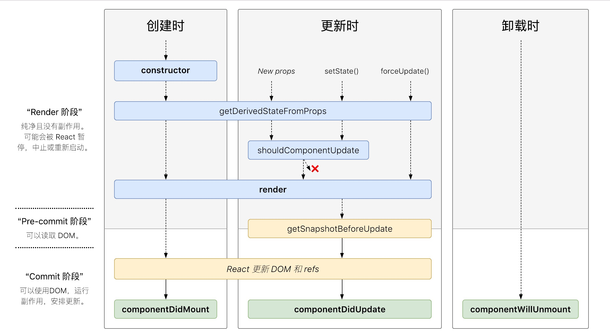

### React 中 keys 的作用是什么？

Keys 是 React 用于追踪哪些列表中元素被修改、被添加或者被移除的辅助标识。

```js
render () {
  return (
    <ul>
      {this.state.todoItems.map(({item, key}) => {
        return <li key={key}>{item}</li>
      })}
    </ul>
  )
}
```

在开发过程中，我们需要保证某个元素的 key 在其同级元素中具有唯一性。在 React Diff 算法中 React 会借助元素的 Key 值来判断该元素是新近创建的还是被移动而来的元素，从而减少不必要的元素重渲染。此外，React 还需要借助 Key 值来判断元素与本地状态的关联关系，因此我们绝不可忽视转换函数中 Key 的重要性。

### React 中 Element 与 Component 的区别是？
简单而言，React Element 是描述屏幕上所见内容的数据结构，是对于 UI 的对象表述。典型的 React Element 就是利用 JSX 构建的声明式代码片然后被转化为createElement的调用组合。而 React Component 则是可以接收参数输入并且返回某个 React Element 的函数或者类。更多介绍可以参考[React Elements vs React Components](https://tylermcginnis.com/react-elements-vs-react-components/)。

### 调用 setState 之后发生了什么？

在代码中调用 setState 函数之后，React 会将传入的参数对象与组件当前的状态合并，然后触发所谓的调和过程（Reconciliation）。经过调和过程，React 会以相对高效的方式根据新的状态构建 React 元素树并且着手重新渲染整个 UI 界面。在 React 得到元素树之后，React 会自动计算出新的树与老树的节点差异，然后根据差异对界面进行最小化重渲染。在差异计算算法中，React 能够相对精确地知道哪些位置发生了改变以及应该如何改变，这就保证了按需更新，而不是全部重新渲染。

### setState到底是异步还是同步？

- 如果是由React引发的事件处理（比如通过onClick引发的事件处理），调用setState不会同步更新this.state
- 绕过React通过addEventListener直接添加的事件处理函数，还有通过setTimeout/setInterval产生的异步调用，则会同步更新this.state

参考文章：[setState何时同步更新状态](https://zhuanlan.zhihu.com/p/26069727?utm_source=tuicool&utm_medium=referral)

### react 新版生命周期函数(react 16.4)

参考文章：[新生命周期函数浅析及升级方案](https://juejin.im/post/5ae6cd96f265da0b9c106931)

### react 旧版生命周期函数

- 初始化阶段：
  - contructor: 初始化state
  - componentWillMount：组件即将被装载、渲染到页面上
  - render:组件在这里生成虚拟的 DOM 节点
  - componentDidMount:组件真正在被装载之后
- 运行中状态：
  - componentWillReceiveProps:组件将要接收到更新属性的时候调用
  - shouldComponentUpdate:组件接受到新属性或者新状态的时候（可以返回 false，接收数据后不更新，阻止 render 调用，后面的函数不会被继续执行了）
  - componentWillUpdate:组件即将更新不能修改属性和状态
  - render:组件重新描绘
  - componentDidUpdate:组件已经更新
- 销毁阶段：
  - componentWillUnmount:组件即将销毁

### shouldComponentUpdate 是做什么的，（react 性能优化是哪个周期函数？）

shouldComponentUpdate 这个方法用来判断是否需要调用 render 方法重新描绘 dom。因为 dom 的描绘非常消耗性能，如果我们能在 shouldComponentUpdate 方法中能够写出更优化的 dom diff 算法，可以极大的提高性能。

参考：[react 性能优化-sf](https://segmentfault.com/a/1190000006254212)

### 为什么虚拟 dom 会提高性能?(必考)

虚拟 dom 相当于在 js 和真实 dom 中间加了一个缓存，利用 dom diff 算法避免了没有必要的 dom 操作，从而提高性能。

用 JavaScript 对象结构表示 DOM 树的结构；然后用这个树构建一个真正的 DOM 树，插到文档当中当状态变更的时候，重新构造一棵新的对象树。然后用新的树和旧的树进行比较，记录两棵树差异把 2 所记录的差异应用到步骤 1 所构建的真正的 DOM 树上，视图就更新了。

参考：[如何理解虚拟 DOM?-zhihu](https://www.zhihu.com/question/29504639?sort=created)

### react diff 原理（常考，大厂必考）

- 把树形结构按照层级分解，只比较同级元素。
- 给列表结构的每个单元添加唯一的 key 属性，方便比较。
- React 只会匹配相同 class 的 component（这里面的 class 指的是组件的名字）
- 合并操作，调用 component 的 setState 方法的时候, React 将其标记为 dirty.到每一个事件循环结束, React 检查所有标记 dirty 的 component 重新绘制.
- 选择性子树渲染。开发人员可以重写 shouldComponentUpdate 提高 diff 的性能。

参考：[React 源码剖析系列 － 不可思议的 react diff](https://zhuanlan.zhihu.com/p/20346379)、[虚拟DOM Diff算法解析](https://www.infoq.cn/article/react-dom-diff)

### React 中 refs 的作用是什么？

Refs 是 React 提供给我们的安全访问 DOM 元素或者某个组件实例的句柄。我们可以为元素添加 ref 属性然后在回调函数中接受该元素在 DOM 树中的句柄，该值会作为回调函数的第一个参数返回：

```js
class CustomForm extends Component {
  handleSubmit = () => {
    console.log("Input Value: ", this.input.value)
  }
  render () {
    return (
      <form onSubmit={this.handleSubmit}>
        <input
          type='text'
          ref={(input) => this.input = input} />
        <button type='submit'>Submit</button>
      </form>
    )
  }
}
```

上述代码中的 input 域包含了一个 ref 属性，该属性声明的回调函数会接收 input 对应的 DOM 元素，我们将其绑定到 this 指针以便在其他的类函数中使用。另外值得一提的是，refs 并不是类组件的专属，函数式组件同样能够利用闭包暂存其值：

```js
function CustomForm ({handleSubmit}) {
  let inputElement
  return (
    <form onSubmit={() => handleSubmit(inputElement.value)}>
      <input
        type='text'
        ref={(input) => inputElement = input} />
      <button type='submit'>Submit</button>
    </form>
  )
}
```

### 如果你创建了类似于下面的 Twitter 元素，那么它相关的类定义是啥样子的？

```js
<Twitter username='tylermcginnis33'>
  {(user) => user === null
    ? <Loading />
    : <Badge info={user} />}
</Twitter>
```

```js
import React, { Component, PropTypes } from 'react'
import fetchUser from 'twitter'
// fetchUser take in a username returns a promise
// which will resolve with that username's data.
class Twitter extends Component {
  // finish this
}
```

如果你还不熟悉回调渲染模式（Render Callback Pattern），这个代码可能看起来有点怪。这种模式中，组件会接收某个函数作为其子组件，然后在渲染函数中以 props.children 进行调用：

```js
import React, { Component, PropTypes } from 'react'
import fetchUser from 'twitter'
class Twitter extends Component {
  state = {
    user: null,
  }
  static propTypes = {
    username: PropTypes.string.isRequired,
  }
  componentDidMount () {
    fetchUser(this.props.username)
      .then((user) => this.setState({user}))
  }
  render () {
    return this.props.children(this.state.user)
  }
}
```

这种模式的优势在于将父组件与子组件解耦和，父组件可以直接访问子组件的内部状态而不需要再通过 Props 传递，这样父组件能够更为方便地控制子组件展示的 UI 界面。譬如产品经理让我们将原本展示的 Badge 替换为 Profile，我们可以轻易地修改下回调函数即可：

```js
<Twitter username='tylermcginnis33'>
  {(user) => user === null
    ? <Loading />
    : <Profile info={user} />}
</Twitter>
```

### 展示组件(Presentational component)和容器组件(Container component)之间有何不同

- 展示组件关心组件看起来是什么。展示专门通过 props 接受数据和回调，并且几乎不会有自身的状态，但当展示组件拥有自身的状态时，通常也只关心 UI 状态而不是数据的状态。
- 容器组件则更关心组件是如何运作的。容器组件会为展示组件或者其它容器组件提供数据和行为(behavior)，它们会调用 Flux actions，并将其作为回调提供给展示组件。容器组件经常是有状态的，因为它们是(其它组件的)数据源。

### 类组件(Class component)和函数式组件(Functional component)之间有何不同

- 类组件不仅允许你使用更多额外的功能，如组件自身的状态和生命周期钩子，也能使组件直接访问 store 并维持状态
- 当组件仅是接收 props，并将组件自身渲染到页面时，该组件就是一个 '无状态组件(stateless component)'，可以使用一个纯函数来创建这样的组件。这种组件也被称为哑组件(dumb components)或展示组件

### (组件的)状态(state)和属性(props)之间有何不同

- State 是一种数据结构，用于组件挂载时所需数据的默认值。State 可能会随着时间的推移而发生突变，但多数时候是作为用户事件行为的结果。
- Props(properties 的简写)则是组件的配置。props 由父组件传递给子组件，并且就子组件而言，props 是不可变的(immutable)。组件不能改变自身的 props，但是可以把其子组件的 props 放在一起(统一管理)。Props 也不仅仅是数据--回调函数也可以通过 props 传递。

### Controlled Component 与 Uncontrolled Component 之间的区别是什么？

在 HTML 中，类似 `<input>`, `<textarea>` 和 `<select>` 这样的表单元素会维护自身的状态，并基于用户的输入来更新。当用户提交表单时，前面提到的元素的值将随表单一起被发送。但在 React 中会有些不同，包含表单元素的组件将会在 state 中追踪输入的值，并且每次调用回调函数时，如 onChange 会更新 state，重新渲染组件。一个输入表单元素，它的值通过 React 的这种方式来控制，这样的元素就被称为"受控元素"。

```js
class ControlledForm extends Component {
  state = {
    username: ''
  }
  updateUsername = (e) => {
    this.setState({
      username: e.target.value,
    })
  }
  handleSubmit = () => {}
  render () {
    return (
      <form onSubmit={this.handleSubmit}>
        <input
          type='text'
          value={this.state.username}
          onChange={this.updateUsername} />
        <button type='submit'>Submit</button>
      </form>
    )
  }
}
```

而非受控组件（Uncontrolled Component）则是由DOM存放表单数据，并非存放在 React 组件中。我们可以使用 refs 来操控DOM元素：

```js
class UnControlledForm extends Component {
  handleSubmit = () => {
    console.log("Input Value: ", this.input.value)
  }
  render () {
    return (
      <form onSubmit={this.handleSubmit}>
        <input
          type='text'
          ref={(input) => this.input = input} />
        <button type='submit'>Submit</button>
      </form>
    )
  }
}
```
竟然非受控组件看上去更好实现，我们可以直接从 DOM 中抓取数据，而不需要添加额外的代码。不过实际开发中我们并不提倡使用非受控组件，因为实际情况下我们需要更多的考虑表单验证、选择性的开启或者关闭按钮点击、强制输入格式等功能支持，而此时我们将数据托管到 React 中有助于我们更好地以声明式的方式完成这些功能。引入 React 或者其他 MVVM 框架最初的原因就是为了将我们从繁重的直接操作 DOM 中解放出来。

### 何为高阶组件(higher order component)

高阶组件是一个以组件为参数并返回一个新组件的函数。HOC 运行你重用代码、逻辑和引导抽象。最常见的可能是 Redux 的 connect 函数。除了简单分享工具库和简单的组合，HOC 最好的方式是共享 React 组件之间的行为。如果你发现你在不同的地方写了大量代码来做同一件事时，就应该考虑将代码重构为可重用的 HOC。

### 为什么建议传递给 setState 的参数是一个 callback 而不是一个对象

因为 this.props 和 this.state 的更新可能是异步的，不能依赖它们的值去计算下一个 state。

### 除了在构造函数中绑定 this，还有其它方式吗

你可以使用属性初始值设定项(property initializers)来正确绑定回调，create-react-app 也是默认支持的。在回调中你可以使用箭头函数，但问题是每次组件渲染时都会创建一个新的回调。

### (在构造函数中)调用 super(props) 的目的是什么

在 super() 被调用之前，子类是不能使用 this 的，在 ES2015 中，子类必须在 constructor 中调用 super()。传递 props 给 super() 的原因则是便于(在子类中)能在 constructor 访问 this.props。

### 应该在 React 组件的何处发起 Ajax 请求
我们应当将AJAX 请求放到 componentDidMount 函数中执行，主要原因有下：
- React 下一代调和算法 Fiber 会通过开始或停止渲染的方式优化应用性能，其会影响到 componentWillMount 的触发次数。对于 componentWillMount 这个生命周期函数的调用次数会变得不确定，React 可能会多次频繁调用 componentWillMount。如果我们将 AJAX 请求放到 componentWillMount 函数中，那么显而易见其会被触发多次，自然也就不是好的选择。
- 如果我们将 AJAX 请求放置在生命周期的其他函数中，我们并不能保证请求仅在组件挂载完毕后才会要求响应。如果我们的数据请求在组件挂载之前就完成，并且调用了setState函数将数据添加到组件状态中，对于未挂载的组件则会报错。而在 componentDidMount 函数中进行 AJAX 请求则能有效避免这个问题。

### 描述事件在 React 中的处理方式。
- 事件代理
1. 区别于浏览器事件处理方式，React并未将事件处理函数与对应的DOM节点直接关联，而是在顶层使用了一个全局事件监听器监听所有的事件；
2. React会在内部维护一个映射表记录事件与组件事件处理函数的对应关系；
3. 当某个事件触发时，React根据这个内部映射表将事件分派给指定的事件处理函数；
4. 当映射表中没有事件处理函数时，React不做任何操作当一个组件安装或者卸载时，相应的事件处理函数会自动被添加到事件监听器的内部映射表中或从表中删除。

- 事件自动绑定
1. 在JavaScript中创建回调函数时，一般要将方法绑定到特定的实例，以保证this的正确性；
2. 在React中，每个事件处理回调函数都会自动绑定到组件实例（使用ES6语法创建的例外）；

- 合成事件
为了解决跨浏览器兼容性问题，您的 React 中的事件处理程序将传递 SyntheticEvent 的实例，它是 React 的浏览器本机事件的跨浏览器包装器。
这些 SyntheticEvent 与您习惯的原生事件具有相同的接口，除了它们在所有浏览器中都兼容。有趣的是，React 实际上并没有将事件附加到子节点本身。React 将使用单个事件监听器监听顶层的所有事件，事件回调执行完毕，则把事件对象属性设为null，便于其它事件重用。这对于性能是有好处的，这也意味着在更新 DOM 时，React 不需要担心跟踪事件监听器。所以需要注意事件回调中使用异步回调引用事件对象属性，则为null，需要使用```event.persist()```处理。

参考文章：[React组件事件详解](https://segmentfault.com/a/1190000013590052)

### createElement 和 cloneElement 有什么区别？

React.createElement():JSX 语法就是用 React.createElement()来构建 React 元素的。它接受三个参数，第一个参数可以是一个标签名。如 div、span，或者 React 组件。第二个参数为传入的属性。第三个以及之后的参数，皆作为组件的子组件。

```js
React.createElement(
    type,
    [props],
    [...children]
)
```

React.cloneElement()与 React.createElement()相似，不同的是它传入的第一个参数是一个 React 元素，而不是标签名或组件。新添加的属性会并入原有的属性，传入到返回的新元素中，而就的子元素奖杯替换。

```js
React.cloneElement(
  element,
  [props],
  [...children]
)
```

### React 中有三种构建组件的方式

React.createClass()、ES6 class 和无状态函数。

### react 组件的划分业务组件技术组件？

- 根据组件的职责通常把组件分为 UI 组件和容器组件。
- UI 组件负责 UI 的呈现，容器组件负责管理数据和逻辑。
- 两者通过 React-Redux 提供 connect 方法联系起来。

### 实现简易react

参考项目：[simple-react](https://github.com/hujiulong/simple-react)

### react context能替代redux吗
react的context api还不能替代redux，context有以下缺点：
- provider组件的value，必须改变后才能重渲染consumer组件；
- 如果某个consumer组件只依赖provider传入的value的一个属性，则value其他属性改变，也会引起所有consumer组件重渲染，造成性能问题；
- redux的provider初始化时只传入store对象，之后store引用对象不变，通过connect组件，利用发布订阅模式重渲染connect返回的组件

### 简述 flux 思想

Flux 的最大特点，就是数据的"单向流动"。

1. 用户访问 View
2. View 发出用户的 Action
3. Dispatcher 收到 Action，要求 Store 进行相应的更新
4. Store 更新后，发出一个"change"事件
5. View 收到"change"事件后，更新页面

### React 项目用过什么脚手架（本题是开放性题目）

creat-react-app Yeoman 等

### 了解 redux 么，说一下 redux 把

- redux 是一个应用数据流框架，主要是解决了组件间状态共享的问题，原理是集中式管理，主要有三个核心方法，action，store，reducer，工作流程是 view 调用 store 的 dispatch 接收 action 传入 store，reducer 进行 state 操作，view 通过 store 提供的 getState 获取最新的数据，flux 也是用来进行数据操作的，有四个组成部分 action，dispatch，view，store，工作流程是 view 发出一个 action，派发器接收 action，让 store 进行数据更新，更新完成以后 store 发出 change，view 接受 change 更新视图。Redux 和 Flux 很像。主要区别在于 Flux 有多个可以改变应用状态的 store，在 Flux 中 dispatcher 被用来传递数据到注册的回调事件，但是在 redux 中只能定义一个可更新状态的 store，redux 把 store 和 Dispatcher 合并,结构更加简单清晰
- 新增 state,对状态的管理更加明确，通过 redux，流程更加规范了，减少手动编码量，提高了编码效率，同时缺点时当数据更新时有时候组件不需要，但是也要重新绘制，有些影响效率。一般情况下，我们在构建多交互，多数据流的复杂项目应用时才会使用它们

### redux 有什么缺点

参考文章：[redux 有什么缺点？](https://www.zhihu.com/question/263928256/answer/274963347)


### react 16.x版本的react fiber和 fiber reconciler解析

参考文章：[React Fiber 那些事: 深入解析新的协调算法](https://www.yuque.com/es2049/blog/nbp4xc)、
[为什么React Fiber使用链表遍历组件树](https://github.com/dawn-plex/translate/blob/master/articles/the-how-and-why-on-reacts-usage-of-linked-list-in-fiber-to-walk-the-components-tree.md)
[React的新引擎—React Fiber是什么？](https://juejin.im/post/5bd55ecc6fb9a05cdd2d5113)、[React Fiber](https://juejin.im/post/5ab7b3a2f265da2378403e57)、[为 Luy 实现 React Fiber 架构](https://zhuanlan.zhihu.com/p/37098539)、[完全理解React Fiber](http://www.ayqy.net/blog/dive-into-react-fiber/)

### react 15.x版本stack reconciler解析

参考文章：[stack reconciler](https://react.css88.com/docs/implementation-notes.html)
