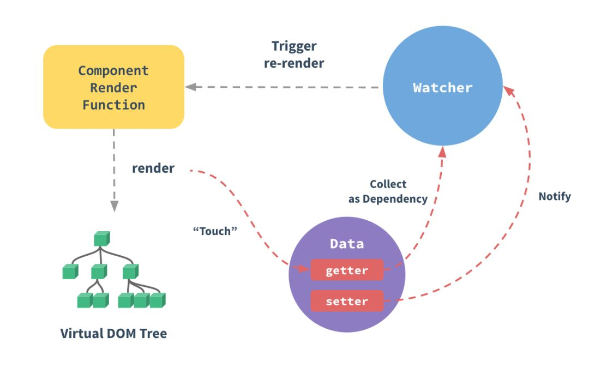

### 什么是 mvvm？

MVVM 是 Model-View-ViewModel 的缩写。mvvm 是一种设计思想。Model 层代表数据模型，也可以在 Model 中定义数据修改和操作的业务逻辑；View 代表 UI 组件，它负责将数据模型转化成 UI 展现出来，ViewModel 是一个同步 View 和 Model 的对象。

在 MVVM 架构下，View 和 Model 之间并没有直接的联系，而是通过 ViewModel 进行交互，Model 和 ViewModel 之间的交互是双向的， 因此 View 数据的变化会同步到 Model 中，而 Model 数据的变化也会立即反应到 View 上。

ViewModel 通过双向数据绑定把 View 层和 Model 层连接了起来，而 View 和 Model 之间的同步工作完全是自动的，无需人为干涉，因此开发者只需关注业务逻辑，不需要手动操作 DOM, 不需要关注数据状态的同步问题，复杂的数据状态维护完全由 MVVM 来统一管理。

### mvvm 和 mvc 区别？

mvc 和 mvvm 其实区别并不大。都是一种设计思想。主要就是 mvc 中 Controller 演变成 mvvm 中的 viewModel。mvvm 主要解决了 mvc 中大量的 DOM 操作使页面渲染性能降低，加载速度变慢，影响用户体验。和当 Model 频繁发生变化，开发者需要主动更新到 View 。

## vue 相关

### vue 的优点是什么？

- 低耦合。视图（View）可以独立于 Model 变化和修改，一个 ViewModel 可以绑定到不同的"View"上，当 View 变化的时候 Model 可以不变，当 Model 变化的时候 View 也可以不变。
- 可重用性。你可以把一些视图逻辑放在一个 ViewModel 里面，让很多 view 重用这段视图逻辑。
- 独立开发。开发人员可以专注于业务逻辑和数据的开发（ViewModel），设计人员可以专注于页面设计。
- 可测试。界面素来是比较难于测试的，而现在测试可以针对 ViewModel 来写。

### vue 响应式原理

当一个Vue实例创建时，vue会遍历data选项的属性，用 Object.defineProperty 将它们转为 getter/setter 并且在内部追踪相关依赖，在属性被访问和修改时通知变化。每个组件实例都有相应的渲染 watcher 程序实例，它会在组件渲染的过程中触发响应式属性 getter ，并把属性记录为依赖，之后当依赖项的setter被调用时，会通知watcher重新计算，从而致使它关联的组件得以更新。



### vue 的渲染流程

  1. ```new Vue()``` 初始化vue实例vm，在构造函数内部调用_init方法，在_init方法中会初始化实例属性并触发```beforeCreate``` 钩子函数，随后最关键的是利用```Object.defineProperty```方法劫持数据建立响应式系统并触发```created```钩子函数；
  2. 接着，执行```vm.$mount```方法，将vm挂载到dom节点上，在这个过程中将模板编译成可用的```render```函数，之后就触发```beforeMount```钩子函数；
  3. 执行```render```函数返回虚拟Dom树，然后利用```__patch__```方法将虚拟Dom节点转换为真实的Dom对象，并挂载到页面中显示完成渲染，随之执行```mounted```钩子函数;

### vue 更新渲染流程

1. 在执行```vm.$mount```过程中会创建一个渲染Watcher对象；
2. 由于对vm数据劫持，在首次渲染时会为响应式属性的dep对象中加入渲染 Watcher 对象；
3. 当对响应式数据做set操作(改变值)时，就会执行属性setter函数，执行```dep.notify()```,触发dep中的Watcher对象执行渲染回调触发更新；
4. 需要注意的是 vue 是在 nextTick 批量更新，避免每次执行setter就触发更新，Vue 异步执行 DOM 更新。只要观察到数据变化，Vue 将开启一个队列，并缓冲在同一事件循环中发生的所有数据改变。如果同一个 watcher 被多次触发，只会被推入到队列中一次。这种在缓冲时去除重复数据对于避免不必要的计算和 DOM 操作上非常重要。然后，在下一个的事件循环“tick”中，Vue 刷新队列并执行实际 (已去重的) 工作。Vue 在内部尝试对异步队列使用原生的 Promise.then 和 MessageChannel，如果执行环境不支持，会采用 setTimeout(fn, 0) 代替。为了在数据变化之后等待 Vue 完成更新 DOM ，可以在数据变化之后立即使用 Vue.nextTick(callback) 。这样回调函数在 DOM 更新完成后就会调用。

### 请详细说下你对 vue 生命周期的理解？

答：总共分为 8 个阶段创建前/后，载入前/后，更新前/后，销毁前/后。

- 创建前/后： 在 beforeCreate 阶段，在钩子函数中无法访问state、props，在created中能够访问state、props。
- 载入前/后：在 beforeMount 阶段，vue实例的render函数已经可用。在 mounted 阶段，vue 实例调用_render方法去生成虚拟DOM树，然后调用_update方法将虚拟DOM映射为真实DOM。
- 更新前/后：当 data 变化时，会触发 beforeUpdate 和 updated 方法。
- 销毁前/后：在执行 destroy 方法后，会执行beforeDestroy钩子函数，然后会对vue实例的事件监听、vdom等进行删除解绑，然后执行destroyed钩子函数，但是页面 dom 结构依然存在，需要手动调用原生dom api进行删除

### 组件之间的通信？

- prop，父组件通过prop向子组件传递参数；
- ```$emit```，子组件通过在内部```$emit```事件,将数据传递给父组件绑定的事件回调函数；
- .sync修饰符，在有些情况下，我们可能需要对一个 prop 进行“双向绑定”。不幸的是，真正的双向绑定会带来维护上的问题，因为子组件可以修改父组件，且在父组件和子组件都没有明显的改动来源。通过.sync属性修饰符，子组件通过调用```this.$emit('update:propertyName', val)```来可以修改 prop ；
- 通过```$parent```、```$children```对象来访问组件实例中的方法和数据；
- ```$attrs``` 和 ```$listeners```；
- ```provide``` / ```inject```；
- EventBus中央事件总线，解决非父子组件通信；
- vuex 官方推荐的，Vuex 是一个专为 Vue.js 应用程序开发的状态管理模式。

参考文章：[Vue.js 父子组件通信的十种方式](https://juejin.im/post/5bd18c72e51d455e3f6e4334)、[vuejs组件通信精髓归纳](https://segmentfault.com/a/1190000018241972)、[Vue.js 父子组件通信的十种方式](https://juejin.im/post/5bd97e7c6fb9a022852a71cf)

### vue 虚拟dom diff算法

很多时候手工优化dom确实会比virtual dom效率高，对于比较简单的dom结构用手工优化没有问题，但当页面结构很庞大，结构很复杂时，手工优化会花去大量时间，而且可维护性也不高，不能保证每个人都有手工优化的能力。至此，virtual dom的解决方案应运而生，virtual dom很多时候都不是最优的操作，但它具有普适性，在效率、可维护性之间达平衡。

参考文章：[解析vue2.0的diff算法](https://github.com/aooy/blog/issues/2)、[详解vue的diff算法](https://juejin.im/post/5affd01551882542c83301da)

### vue 的computed计算属性原理

- computed属性会定义一个computed watcher，computed属性对应的函数，就是watcher的getter
- 同时在vm上通过 Object.defineProperty 定义属性getter
- 当vm渲染时，调用 computed 属性getter，则会向 computed 属性依赖的属性添加 computed watcher和 渲染watcher
- 当 computed 属性依赖的属性值发生改变，则触发 computed watcher 重新计算 computed属性值，同时触发渲染watcher，这时渲染 watcher 读取到的computed属性新值，则渲染的模板发生更新。
- 综上，computed 属性基于它们的依赖进行缓存的，只在相关依赖发生改变时它们才会重新求值，如下代码逻辑：

```js
function createComputedGetter (key) {
  return function computedGetter () {
    const watcher = this._computedWatchers && this._computedWatchers[key]
    if (watcher) {
      if (watcher.dirty) { //只有依赖属性发生改变，dirty才是true，这时重新计算
        watcher.evaluate()
      }
      if (Dep.target) {   //渲染watcher
        watcher.depend() //computed依赖属性dep添加渲染watcher
      }
      return watcher.value
    }
  }
}
```

### vue 的watch侦听器属性原理

watch属性会对观察的属性添加一个 user watcher，当属性值变化时，就会触发 user watcher 回调函数执行

### vue 的计算属性和侦听器属性用途

计算属性适合用在模板渲染中，某个值是依赖了其它的响应式对象甚至是计算属性计算而来；而侦听属性适用于观测某个值的变化去完成一段复杂的业务逻辑。
另外 computed 和 watch 还都支持对象的写法，这种方式知道的人并不多。

```js
vm.$watch('obj', {
    // 深度遍历
    deep: true,
    // 立即触发
    immediate: true,
    // 执行的函数
    handler: function(val, oldVal) {}
})
var vm = new Vue({
  data: { a: 1 },
  computed: {
    aPlus: {
      // this.aPlus 时触发
      get: function () {
        return this.a + 1
      },
      // this.aPlus = 1 时触发
      set: function (v) {
        this.a = v - 1
      }
    }
  }
})
```

### vue 模板编译过程

1. parse, 把 template 模板字符串转换成 AST 树，它是一种用 JavaScript 对象的形式来描述整个模板,整个 parse 的过程是利用正则表达式顺序解析模板，当解析到开始标签、闭合标签、文本的时候都会分别执行对应的回调函数，来达到构造 AST 树的目的
2. optimize, 经过 parse 过程后，会输出生成 AST 树，那么接下来我们需要对这颗树做优化。 Vue 是数据驱动，是响应式的，但是我们的模板并不是所有数据都是响应式的，也有很多数据是首次渲染后就永远不会变化的，那么这部分数据生成的 DOM 也不会变化，我们可以在 patch 的过程跳过对他们的比对，在编译阶段可以把一些 AST 节点优化成静态节点
3. codegen, 编译的最后一步就是把优化后的 AST 树转换成可执行的代码

### keep-alive组件

如果你需要在组件切换的时候，保存一些组件的状态防止多次渲染，就可以使用 keep-alive 组件包裹需要保存的组件。

对于 keep-alive 组件来说，它拥有两个独有的生命周期钩子函数，分别为 activated 和 deactivated 。用 keep-alive 包裹的组件在切换时不会进行销毁，而是缓存到内存中并执行 deactivated 钩子函数，命中缓存渲染后会执行 actived 钩子函数。

### 自定义指令(v-check, v-focus) 的方法有哪些? 它有哪些钩子函数? 还有哪些钩子函数参数

- 全局定义指令：在 vue 对象的 directive 方法里面有两个参数, 一个是指令名称, 另一个是函数。
- 组件内定义指令：directives
- 钩子函数: bind(绑定事件出发)、inserted(节点插入时候触发)、update(组件内相关更新)
- 钩子函数参数： el、binding

### 说出至少 4 种 vue 当中的指令和它的用法

v-if(判断是否隐藏)、v-for(把数据遍历出来)、v-bind(绑定属性)、v-on(绑定事件)、v-model(实现双向绑定)、v-html(插入html)

## vue-router 相关

### vue-router 运行原理

1. 定义VueRouter构造函数，VueRouter函数定义静态方法install，Vue.use安装VueRouter
2. 在安装VueRouter过程中，为组件实例添加```$route```、```$router```属性，全局注册```router-view```和```router-link```组件，并全局mixin，为根vue实例配置beforeCreate钩子，钩子中执行```this._router.init```方法
3. ```this._router```就是```new VueRouter(config)```生成的实例，构造函数会根据路由配置确定hash模式还是history模式，从而初始化相应的history实例
4. 根vue实例运行beforeCreate钩子执行```this._router.init```方法，这个方法执行```this.history.transitionTo```方法用于路由切换
5. 根据目标页面路径匹配出相应的路由组件列表，和当前页面路径路由组件列表作比较，获得updated、deactivated、
activated路由组件队列
6. 根据上述队列，按顺序执行导航守卫钩子：
    1. 触发进入其他路由。
    2. 调用要离开路由的组件守卫beforeRouteLeave
    3. 调用全局前置守卫：beforeEach
    4. 在重用的组件里调用 beforeRouteUpdate
    5. 在激活的路由配置里调用 beforeEnter。
    6. 解析异步路由组件。
    7. 在被激活的组件里调用 beforeRouteEnter(组件实例还没创建，不能直接使用this)。
    8. 调用全局的 beforeResolve 守卫
    9. 导航被确认。
    10. 调用全局后置钩子的 afterEach 钩子。
    11. 触发DOM更新(mounted)
    12. 执行beforeRouteEnter 守卫中传给 next 的回调函数

### active-class 是哪个组件的属性？

vue-router 模块的 router-link 组件。

### vue-router 有哪几种导航钩子?

三种

- 全局导航钩子
  - router.beforeEach(to, from, next),
  - router.beforeResolve(to, from, next),
  - router.afterEach(to, from ,next)
- 组件内钩子
  - beforeRouteEnter,
  - beforeRouteUpdate,
  - beforeRouteLeave
- 单独路由独享组件
  - beforeEnter

### 嵌套路由怎么定义？

在实际项目中我们会碰到多层嵌套的组件组合而成，但是我们如何实现嵌套路由呢？因此我们需要在 VueRouter 的参数中使用 children 配置，这样就可以很好的实现路由嵌套。
index.html，只有一个路由出口

```js
<div id="app">
    <!-- router-view 路由出口, 路由匹配到的组件将渲染在这里 -->
    <router-view></router-view>
</div>
```

main.js，路由的重定向，就会在页面一加载的时候，就会将 home 组件显示出来，因为重定向指向了 home 组件，redirect 的指向与 path 的必须一致。children 里面是子路由，当然子路由里面还可以继续嵌套子路由。

```js
import Vue from 'vue'
import VueRouter from 'vue-router'
Vue.use(VueRouter)

//引入两个组件

import home from "./home.vue"
import game from "./game.vue"
//定义路由
const routes = [
    { path: "/", redirect: "/home" },//重定向,指向了home组件
    {
        path: "/home", component: home,
        children: [
            { path: "/home/game", component: game }
        ]
    }
]
//创建路由实例
const router = new VueRouter({routes})

new Vue({
    el: '#app',
    data: {
    },
    methods: {
    },
    router
})
```

home.vue，点击显示就会将子路由显示在出来，子路由的出口必须在父路由里面，否则子路由无法显示。

### 路由之间跳转？

- 声明式（标签跳转） `<router-link :to="index">`
- 编程式（ js 跳转） `router.push('index')`

### 懒加载（按需加载路由）（常考）

webpack 中提供了 require.ensure()来实现按需加载。以前引入路由是通过 import 这样的方式引入，改为 const 定义的方式进行引入。

- 不进行页面按需加载引入方式：

```js
import home from '../../common/home.vue'
```

- 进行页面按需加载的引入方式：

```js
const home = r => require.ensure( [], () => r (require('../../common/home.vue')))
```

## vuex 相关

### vuex 是什么？怎么使用？哪种功能场景使用它？

vue 框架中状态管理。在 main.js 引入 store，注入。新建了一个目录 store 。场景有：单页应用中，组件之间的状态。音乐播放、登录状态、加入购物车

```js
// 新建 store.js
import vue from 'vue'
import vuex form 'vuex'
vue.use(vuex)
export default new vuex.store({
	//...code
})

//main.js
import store from './store'
...
```

### vuex 有哪几种属性

有 5 种，分别是 state、getters、mutations、actions、modules

### vuex 的 store 特性是什么

- vuex 就是一个仓库，仓库里放了很多对象。其中 state 就是数据源存放地，对应于一般 vue 对象里面的 data
- state 里面存放的数据是响应式的，vue 组件从 store 读取数据，若是 store 中的数据发生改变，依赖store中的数据的组件也会发生更新

### vuex 的 getter 特性是什么

- getter 可以对 state 进行计算操作，它就是 store 的计算属性
- 虽然在组件内也可以做计算属性，但是 getters 可以在多组件之间复用
- 如果一个状态只在一个组件内使用，是可以不用 getters

### vuex 的 mutation 特性是什么

- mutation中只能进行同步操作
- action 类似于 muation, 不同在于：action 提交的是 mutation,而不是直接变更状态
- action 可以包含任意异步操作

### vue 中 ajax 请求代码应该写在组件的 methods 中还是 vuex 的 action 中

如果请求来的数据不是要被其他组件公用，仅仅在请求的组件内使用，就不需要放入 vuex 的 state 里

如果被其他地方复用，请将请求放入 action 里，方便复用，并包装成 promise 返回

### 不用 vuex 会带来什么问题

- 可维护性会下降，你要修改数据，你得维护 3 个地方
- 可读性下降，因为一个组件里的数据，你根本就看不出来是从哪里来的
- 增加耦合，大量的上传派发，会让耦合性大大的增加，本来 Vue 用 Component 就是为了减少耦合，现在这么用，和组件化的初衷相背

### vuex 原理

vuex 仅仅是作为 vue 的一个插件而存在，不像 Redux,MobX 等库可以应用于所有框架，vuex 只能使用在 vue 上，很大的程度是因为其高度依赖于 vue 的 computed 依赖检测系统以及其插件系统，

vuex 整体思想诞生于 flux,可其实现方式完完全全的使用了 vue 自身的响应式设计，依赖监听、依赖收集都属于 vue 对象 Property set get 方法的代理劫持。vuex 中的 store 本质就是没有 template 的隐藏着的 vue 组件；

### 使用 Vuex 只需执行 Vue.use(Vuex)，并在 Vue 的配置中传入一个 store 对象的示例，store 是如何实现注入的？[美团](https://tech.meituan.com/vuex_code_analysis.html)

Vue.use(Vuex) 方法执行的是 install 方法，它实现了 Vue 实例对象的 init 方法封装和注入，使传入的 store 对象被设置到 Vue 上下文环境的 ```$store``` 中。因此在 Vue Component 任意地方都能够通过 this.$store 访问到该 store。

### state 内部支持模块配置和模块嵌套，如何实现的？[美团](https://tech.meituan.com/vuex_code_analysis.html)

在 store 构造方法中有 makeLocalContext 方法，所有 module 都会有一个 local context，根据配置时的 path 进行匹配。所以执行如 dispatch('submitOrder', payload)这类 action 时，默认的拿到都是 module 的 local state，如果要访问最外层或者是其他 module 的 state，只能从 rootState 按照 path 路径逐步进行访问。

### 在执行 dispatch 触发 action(commit 同理)的时候，只需传入(type, payload)，action 执行函数中第一个参数 context 从哪里获取的？[美团](https://tech.meituan.com/vuex_code_analysis.html)

store 初始化时，所有配置的 action 和 mutation 以及 getters 均被封装过。在执行如 dispatch('submitOrder', payload)的时候，actions 中 type 为 submitOrder 的所有处理方法都是被封装后的，其第一个参数为 context 对象:
```js
{
  state,      // 等同于 `store.state`，若在模块中则为局部状态local.state
  rootState,  // 等同于 `store.state`，只存在于模块中
  commit,     // 等同于 `store.commit`
  dispatch,   // 等同于 `store.dispatch`
  getters,    // 等同于 `store.getters`， 若在模块中则为局部local.getters
  rootGetters // 等同于 `store.getters`，只存在于模块中
}
```

### Vuex 如何区分 state 是外部直接修改，还是通过 mutation 方法修改的？[美团](https://tech.meituan.com/vuex_code_analysis.html)

Vuex 中修改 state 的唯一渠道就是执行 commit('xx', payload) 方法，其底层通过执行 this._withCommit(fn) 设置 _committing 标志变量为 true，然后才能修改 state，修改完毕还需要还原_committing 变量。外部修改虽然能够直接修改 state，但是并没有修改 _committing 标志位，所以只要 watch 一下 state，state change 时判断是否_committing 值为 true，即可判断修改的合法性。

### 调试时的"时空穿梭"功能是如何实现的？[美团](https://tech.meituan.com/vuex_code_analysis.html)

devtoolPlugin 中提供了此功能。因为 dev 模式下所有的 state change 都会被记录下来，'时空穿梭' 功能其实就是将当前的 state 替换为记录中某个时刻的 state 状态，利用 store.replaceState(targetState) 方法将执行 this._vm.state = state 实现。


## Vue 遇到业务问题总结

### Vue 管理后台权限路由实现方式

- 如果权限角色比较简单，可以前端定好角色和路由的关系，后端接口返回用户角色，前端判断角色对应路由权限，缺点是前端需要清楚角色和路由之间的对应关系；菜单信息写死在前端，要改个显示文字或权限信息，需要重新编译；菜单跟路由耦合在一起，定义路由的时候还有添加菜单显示标题，图标之类的信息，而且路由不一定作为菜单显示，还要多加字段进行标识

- 如果权限角色复杂，则需要将用户权限关系数据保存在后端，将后端返回路由通过 addRoutes 动态挂载之前，需要将数据处理一下，将component字段换为真正的路由组件路径，生成真正的路由配置表，再通过 addRoutes 动态挂载。

参考文章：[vue权限路由实现方式总结](https://juejin.im/post/5b5bfd5b6fb9a04fdd7d687a)

### Vue 服务端渲染

参考文章：[Vue服务端渲染实践](https://segmentfault.com/a/1190000018577041)

### Vue实战

参考文章：[Vue实战](https://mp.weixin.qq.com/s/mn3bxEUXAw_5lrm7eUX-wA)
